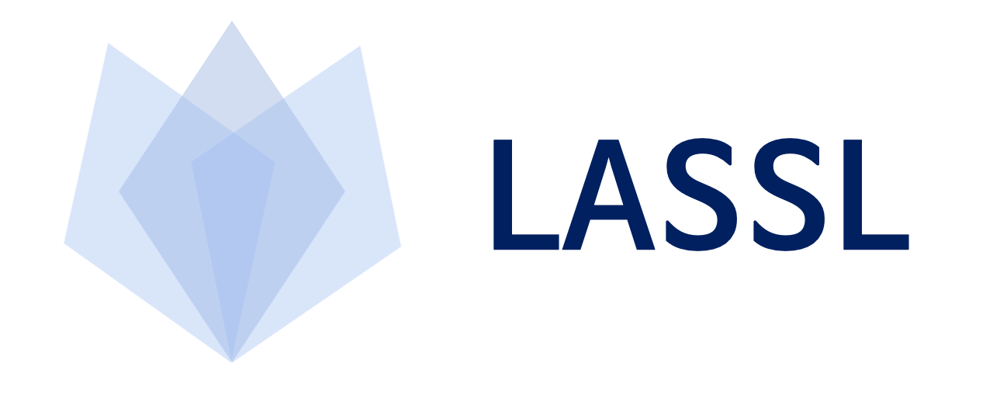

<div align="center">



**Easy Language Model Pretraining leveraging Huggingface's [Transformers](https://github.com/huggingface/transformers) and [Datasets](https://github.com/huggingface/datasets)**

<p align="center">
  <a href="#what-is-lassl">What is LASSL</a> •
  <a href="#how-to-use">How to Use</a>
</p>

<p>
    <b>한국어</b>
</p>

<p align="center">
    <a href="https://github.com/lassl/lassl/blob/master/LICENSE">
        
    </a>
    <a href="https://github.com/lassl/lassl/issues">
        
    </a>
</p>

</div>

## What is LASSL
LASSL은 데이터만 있다면 누구나 쉽게 자신만의 사전학습 언어모델을 학습할 수 있도록 Huggingface의 Transformers, Datasets 라이브러리를 이용해 언어 모델 사전학습을 제공합니다.


## How to Use
언어 모델 사전학습은 크게 1. 토크나이저 학습, 2. 코퍼스 시리얼라이즈, 3. 언어 모델 사전학습의 세 단계로 나눌 수 있습니다. 데이터셋을 지원하는 형식에 맞춰 준비한 뒤 순서에 따라 진행하면 자신만의 사전학습 모델을 만들 수 있습니다.

### 1. Train Tokenizer
```bash
$ peotry run python3 train_tokenizer.py --corpora_dir $CORPORA_DIR --model_type $MODEL_TYPE --vocab_size $VOCAB_SIZE
```

### 2. Serialize Corpora
```bash
$ peotry run python3 serialize_corpora.py --corpora_dir $CORPORA_DIR --tokenizer_dir $TOKENIZER_DIR --model_type --max_length $MAX_LENGTH
```

### 3. Pretrain Language Model
```bash
$ peotry run python3 pretrain_language_model.py --config_path $CONFIG_PATH
```

## Contributors
[Boseop Kim](https://github.com/seopbo), [Minho Ryu](https://github.com/bzantium), [Inje Ryu](https://github.com/iron-ij), [Jangwon Park](https://github.com/monologg) and [Hyoungseok Kim](https://github.com/alxiom)

## Acknowledgements

LASSL은 Tensorflow Research Cloud (TFRC) 프로그램의 Cloud TPU 지원으로 제작되었습니다.
