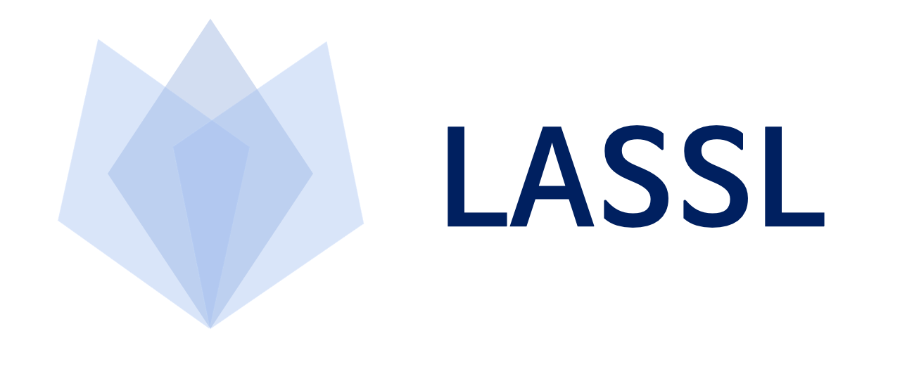

<div align="center">



**Easy Language Model Pretraining leveraging Huggingface's [Transformers](https://github.com/huggingface/transformers) and [Datasets](https://github.com/huggingface/datasets)**

<p align="center">
  <a href="#what-is-lassl">What is LASSL</a> •
  <a href="#how-to-use">How to Use</a>
</p>

<p>
    <a href="README.md">English</a> |
    <b>한국어</b>
</p>

<p align="center">
    <a href="https://github.com/lassl/lassl/blob/master/LICENSE">
        
    </a>
    <a href="https://github.com/lassl/lassl/issues">
        
    </a>
    <a href="https://huggingface.co/lassl">
        
    </a>
</p>

</div>

## What is LASSL
LASSL은 **LA**nguage **S**elf-**S**upervised **L**earning의 약자로, 데이터만 있다면 누구나 쉽게 자신만의 언어모델을 가질 수 있도록 Huggingface의 Transformers, Datasets 라이브러리를 이용해 **언어 모델 사전학습**을 제공합니다.

## Environment setting
먼저 컴퓨팅 환경에 알맞은 버전의 pytorch를 설치해야합니다. 그 다음 아래의 명령어를 통해 `lassl`을 설치할 수 있습니다.

```bash
pip3 install .
```

## How to Use
- 언어 모델 사전학습은 크게 **1. 토크나이저 학습**, **2. 코퍼스 시리얼라이즈**, **3. 언어 모델 사전학습**의 세 단계로 나눌 수 있습니다. 
- **데이터셋을 지원하는 형식**에 맞춰 준비한 뒤 순서에 따라 진행하면 자신만의 사전학습 모델을 만들 수 있습니다. <a href="https://github.com/lassl/lassl/blob/main/docs/supported_dataset_ko.md">지원하는 코퍼스 형태(corpus_type)는 여기서 확인할 수 있습니다.</a>

### 1. Train Tokenizer
```bash
python3 train_tokenizer.py \
    --corpora_dirpath $CORPORA_DIR \
    --corpus_type $CORPUS_TYPE \
    --sampling_ratio $SAMPLING_RATIO \
    --model_type $MODEL_TYPE \
    --vocab_size $VOCAB_SIZE \
    --min_frequency $MIN_FREQUENCY
```

### 2. Serialize Corpora
```bash
python3 serialize_corpora.py \
    --model_type $MODEL_TYPE \
    --tokenizer_dir $TOKENIZER_DIR \
    --corpora_dir $CORPORA_DIR \
    --corpus_type $CORPUS_TYPE \
    --max_length $MAX_LENGTH \
    --num_proc $NUM_PROC
```

### 3. Pretrain Language Model
```bash
python3 pretrain_language_model.py --config_path $CONFIG_PATH
```


```bash
# TPU를 사용할 때는 아래 명령어를 사용합니다. (poetry 환경은 PyTorch XLA를 기본으로 제공하지 않습니다.)
python3 xla_spawn.py --num_cores $NUM_CORES pretrain_language_model.py --config_path $CONFIG_PATH
```

## Contributors
김보섭|류민호|류인제|박장원|김형석
:-:|:-:|:-:|:-:|:-:
![image1][image1]|![image2][image2]|![image3][image3]|![image4][image4]|![image5][image5]
[Github](https://github.com/seopbo)|[Github](https://github.com/bzantium)|[Github](https://github.com/iron-ij)|[Github](https://github.com/monologg)|[Github](https://github.com/alxiom)

[image1]: https://avatars.githubusercontent.com/seopbo
[image2]: https://avatars.githubusercontent.com/bzantium
[image3]: https://avatars.githubusercontent.com/iron-ij
[image4]: https://avatars.githubusercontent.com/monologg
[image5]: https://avatars.githubusercontent.com/alxiom

## Acknowledgements
LASSL은 Tensorflow Research Cloud (TFRC) 프로그램의 Cloud TPU 지원으로 제작되었습니다.